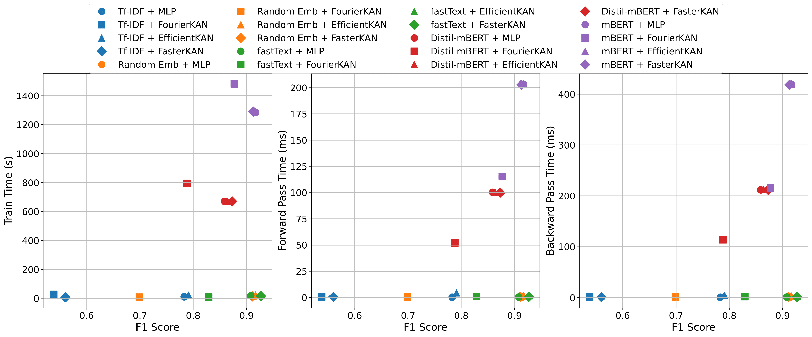

# myNews: Burmese News Dataset

myNews is designed to support research and development in low-resource NLP, particularly for Burmese, where standardized datasets are limited. It contains **manually-labeled Burmese news paragraphs** across **six categories**:

* **Politics**
* **Sports**
* **Business**
* **Technology**
* **Entertainment**
* **Environment**

In addition to its research value, this dataset played a key role in earning the **Best Paper Award at the 20th IEEE iSAI-NLP 2025 Conference**, where it served as the foundation for our study on improving Burmese news classification using Kolmogorov–Arnold Network (KAN). We are releasing the dataset publicly to support open research, ensure reproducibility, and encourage further advancements in Burmese NLP beyond our own work.

---

## Table of Contents

- [Dataset Structure](#dataset-structure)  
- [Dataset Statistics](#dataset-statistics)  
- [Example Data (per class)](#example-data-per-class)  
- [Preprocessing Information](#preprocessing-information)  
- [Citations](#citations)  
- [KAN Classification Benchmark](#kolmogorov-arnold-network-classification-benchmark-on-mynews-dataset)  
- [Contact](#contact)  
- [License](#license)

## Dataset Structure

```

/data/v1/classification/
|- myNews_v1_classification_train.txt
|- myNews_v1_classification_test.txt
|- myNews_v1_classification_full.txt

```

Each file contains:

| Column  | Description                                                                 |
| ------- | --------------------------------------------------------------------------- |
| `text`  | Burmese news paragraph                                                      |
| `label` | One of {sports, politics, business, technology, entertainment, environment} |

---

## Dataset Statistics

| Class         | Count | Percentage |
| ------------- | ----- | ---------- |
| Sports        | 1,232 | 16.84%     |
| Politics      | 1,228 | 16.79%     |
| Technology    | 1,224 | 16.73%     |
| Business      | 1,221 | 16.69%     |
| Entertainment | 1,205 | 16.47%     |
| Environment   | 1,205 | 16.47%     |

* **Total samples:** ~7,315  
* **Train:** 80% (~5.84k)  
* **Test:** 20% (~1.47k)

## Example Data (per class)

| Category          | Example (Burmese + English)                                                                                                                                                                                                                                                                                                                                                                                                                                             |
| ----------------- | ----------------------------------------------------------------------------------------------------------------------------------------------------------------------------------------------------------------------------------------------------------------------------------------------------------------------------------------------------------------------------------------------------------------------------------------------------------------------- |
| **Sports**        | အကြို ဗိုလ်လုပွဲတွင် အနိုင်ရရှိသည့်နှစ်သင်းက ဗိုလ်လုပွဲထပ်မံယှဉ်ပြိုင်ရမည်ဖြစ်ပြီး ရှုံးနိမ့်သည့်နှစ်သင်းက တတိယနေရာလုပွဲ ဆက်လက်ကစားရမည်ဖြစ်သည်။<br>The two teams that win the semi-finals will compete in the final, while the two losing teams will play in the third-place match.                                                                                                                                                                                     |
| **Politics**      | အရေးအကြီးဆုံးက သူ့ကို ခြစားမှု၊ အလွဲသုံးစားမှုနဲ့ အမြတ်ထုတ်မှု စွပ်စွဲမှုတွေမရှိဖူးသေးပါ။ မစ္စတာအူမဲရောဗ်ဟာ ဟော့လော့စ်ပါတီကနေ ရွေးကောက်ပွဲဝင်ရင်း နိုင်ငံရေးလောကထဲကို ၂၀၁၉ မှာဝင်ရောက်လာခဲ့တယ်။ အဲဒီနောက် အစိုးရအရာရှိဖြစ်လာခဲ့ပါတယ်။<br>Most importantly, he has never been accused of corruption, misuse of funds, or exploitation. Mr. Umerov entered politics in 2019, running as a candidate for the Holos party. After that, he became a government official.     |
| **Technology**    | နိုင်ငံတကာ အာကာသစခန်းဟာ လာမယ့် ၂၀၃၀ အထိ အလုပ်လုပ်နေဦးမှာဖြစ်ပြီး ၂၀၃၁ မှာ ပစိဖိတ်သမုဒ္ဒရာထဲကို ပျက်ကျလာလိမ့်မယ်လို့ နာဆာကပြောပါတယ်။<br>NASA says the International Space Station will continue to operate until 2030 and will de-orbit into the Pacific Ocean in 2031.                                                                                                                                                                                                  |
| **Business**      | ၂၀၂၃-၂၀၂၄ ဘဏ္ဍာနှစ် ငါးလအတွင်း ပြည်ပသို့ ရေထွက်ပစ္စည်း တင်ပို့မှ ဒေါ်လာ ၂၄၁ သန်းကျော် ရရှိရှိပြီး ပင်လယ်ရေကြောင်းကုန်သွယ်မှုမှ ဒေါ်လာ ၁၃၄ သန်းကျော် တင်ပို့ထားကြောင်း စီးပွားရေးနှင့် ကူးသန်းရောင်းဝယ်ရေးဝန်ကြီးဌာနမှ သိရသည်။<br>The Ministry of Commerce announced that over $241 million was earned from exporting fishery products abroad during the first five months of the 2023-2024 fiscal year, with more than $134 million of that coming from maritime trade. |
| **Entertainment** | အဖွဲ့ဝင်လီဆာ အင်စတာဂရမ်တွင် ပို့စ်တစ်ခုတင်လိုက်သည်နှင့် အမေရိကန်ဒေါ်လာ ၅၇၅,၀၀၀ ရနေပြီး သားဟုဆိုရှယ်မီဒီယာ မားကတ်တင်းပလက်ဖောင်းက ထုတ်ပြန်သည့် အင်စတာဂရမ်ဖြင့် ချမ်းသာနေသူများစာရင်းတွင်ဆိုထားသည်။<br>According to a list of "Instagram rich" compiled by a social media marketing platform, group member Lisa earns $575,000 for each post on Instagram.                                                                                                                 |
| **Environment**   | ဒီမြောက်တွေကို အမဲလိုက်သတ်ဖြတ်နေတဲ့အကြောင်းနဲ့ပက်သက်ပြီး ဥပဒေအရ အရေးယူတာတွေ၊ မြောက်လေးတွေကို ထိန်းသိမ်းတာတွေကိုတော့ မကြားမိသေးဘူးလို့ ကိုဝင်းပိုင်ဦးက ဆက်ပြောပါသည်။<br>Ko Win Paing Oo added that he hasn't heard of any legal action being taken against those who are hunting and killing the monkeys or any efforts to conserve them.                                                                                                                                |

## Preprocessing Information

We applied:

* Unicode normalization
* Syllable segmentation via **myWord**
* Standard punctuation cleanup
* Removal of malformed sequences

## Citations

If you use this dataset, please cite:

```
@inproceedings{aung2025kannews,
title={Enhancing Burmese News Classification with Kolmogorov-Arnold Network Head Fine-tuning},
author={Aung, Thura and Kyaw, Eaint Kay Khaing and Thu, Ye Kyaw and Myint Oo, Thazin and Supnithi, Thepchai},
booktitle={2025 20th International Joint Symposium on Artificial Intelligence and Natural Language Processing (iSAI-NLP)},
pages={1--6},
year={2025},
keywords={Kolmogorov-Arnold Network; Head finetuning; Transformers; News Classification; FourierKAN; FasterKAN; EfficientKAN},
location={Phuket, Thailand}
}
```

## Kolmogorov-Arnold Network Classification Benchmark on myNews dataset



Benchmark last update: 23 November 2025 

## Corresponding authors
- Ye Kyaw Thu [Email](ykt.nlp.ai@gmail.com) [Website](https://sites.google.com/site/yekyawthunlp/)
- Thura Aung [Email](thuraaung.ai.mdy@gmail.com) [LinkedIn](https://www.linkedin.com/in/thura-aung)

## License

This project is licensed under the **MIT License** — see the [LICENSE](LICENSE) file for details.

## References
- **myWord Tool**: [GitHub Repository](https://github.com/ye-kyaw-thu/myWord)
- **Faster KAN**: [GitHub Repository](https://github.com/AthanasiosDelis/faster-kan)
- **Efficient KAN**: [GitHub Repository](https://github.com/Blealtan/efficient-kan)
- **Fourier KAN**: [GitHub Repository](https://github.com/GistNoesis/FourierKAN)
